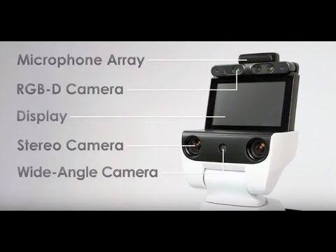
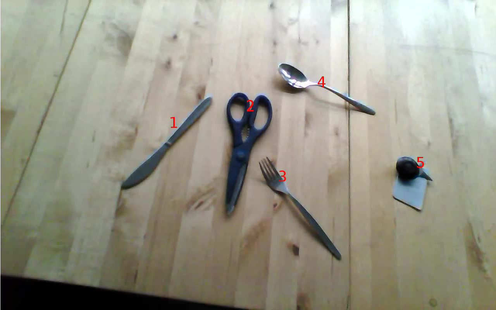

Project-2018
======

# Object list merger

Modern robots are equiped with differnt modalities(sensors). These help the
robot to perceive the environment and make decisions. For example the Toyota
HSR has the following modalities.

1. RGBD camera
2. Wide angle camera
3. Stero camera
4. Gripper camera
5. Laser scanner

Different modalities can be used as a redundant source of information to make
precise  conclusion of the environment. For example in our case we consider the
task of perceiving the objects infront of the robot. Here the robot can use the
different modalities it has mainly the differnt cameras.

In case of the HSR we use 2 cameras:
1. RGBD camera
2. Stero camera

The images from the camera is passed through some state-of-the-art image
recognition algorithms. We use 2 such algorithms for creating the prediction
based on the different modalities
1. RGBD camera: RGB-D-Based Features for Recognition of Textureless Objects[1]
2. RGB camera: MobileNet[2]

Based on the modality and the algorithm used they produce a list of perceived objects.
For example the robot standing in front of the table and perceiving the table

1. RGBD camera : [(knife,1, 99%), (scissor, 2, 65%), (spoon, 3, 33%), (spoon, 4, 80%), (keys, 5, 95%)]
2. RGB camera : [(knife,1, 55%), (scissor, 2, 95%), (fork, 3, 99%), (spoon, 4, 99%), (keys, 5, 95%) ]

The list is a tuple of 3, explaining the following:
1. Object Name
2. Unique numbering for each object in each scene
3. Confidence of the algorithm about the object

## Goal
The Goal of the project is to combine such different information obtained from
differnent modalities passed through different algorithms.

## Objectives

1. Converting requirements to specific code design.
2. Using proper design patterns.
3. Test driven development.
4. Following coding standards.
5. Refactoring when required.
6. Adhering to different good coding practices.

## Requirements:

1. Nov 27 : [Intial Requirement](initial_requirement.md)
2. Dec 4
3. Dec 11
4. Dec 18
5. Holidays Dec 24 - Jan 6
6. Jan 08
7. Jan 15
8. Jan 22 : Final Project Presentation

## Reference:
[1] Thoduka S., Pazekha S., Moriarty A., Kraetzschmar G.K. (2017) RGB-D-Based
Features for Recognition of Textureless Objects. In: Behnke S., Sheh R., Sarıel
S., Lee D. (eds) RoboCup 2016: Robot World Cup XX. RoboCup 2016. Lecture Notes
in Computer Science, vol 9776. Springer, Cham

[2] MobileNets: Efficient Convolutional Neural Networks for Mobile Vision
Applications
Andrew G. Howard, Menglong Zhu, Bo Chen, Dmitry Kalenichenko, Weijun Wang,
Tobias Weyand, Marco Andreetto, Hartwig Adam  MobileNets: Efficient
Convolutional Neural Networks for Mobile Vision Applications
Andrew G. Howard, Menglong Zhu, Bo Chen, Dmitry Kalenichenko, Weijun Wang,
Tobias Weyand, Marco Andreetto, Hartwig Adam arxiv.org/abs/1704.04861ruoljfljsaf
